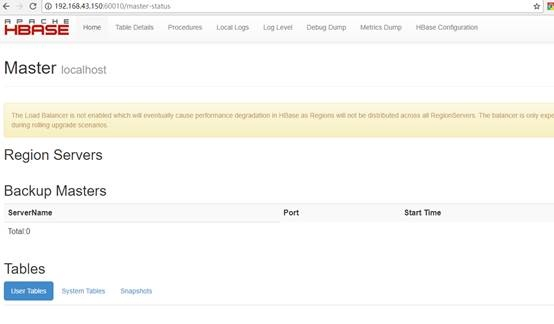

# 4. Hbase的安装与启动

2. 配置 $HBASE_HOME/conf/hbase-site.xml

```
             <!--配置hbase的根目录，一般配置成hdfs-->

              <property>

                   <name>hbase.rootdir</name>

                   <value>hdfs://115.26.129.107:9000/hbase</value>

              </property>

             

              <!--配置hbase的节点信息的存储目录，需要配置成zookeeper的节点信息存储目录-->

              <property>

                   <name>hbase.zookeeper.property.dataDir</name>

                   <value>/home/hadoop/app/zookeeper-3.4.5-cdh5.7.0/data/zk1</value>

              </property>

             

              <!--开启hbase的分布式模式开关-->

              <property>

                   <name>hbase.cluster.distributed</name>

                   <value>true</value>

              </property>

             

              <!--和zookeeper通信端口-->

              <property>

                   <name>hbase.zookeeper.property.clientPort</name>

                   <value>2181</value>

              </property>

             

              <!--告知hbase所有的zookeeper实例-->

              <property>

                   <name>hbase.zookeeper.quorum</name>

                   <value>127.0.0.1:2181,127.0.0.1:2182,127.0.0.1:2183</value>

              </property>


```

配置 $HBASE_HOME/conf/hbase-env.sh

              修改: JAVA_HOME=/usr/java/jdk1.8.0_171-amd64

                     HBASE_MANAGES_ZK=false
                     

启动. /bin/start-hbase.sh

多了HRegionServer，HMaster


验证Hbase是否启动


                    
                    