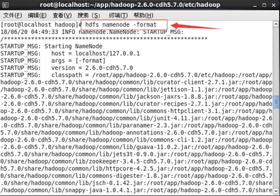
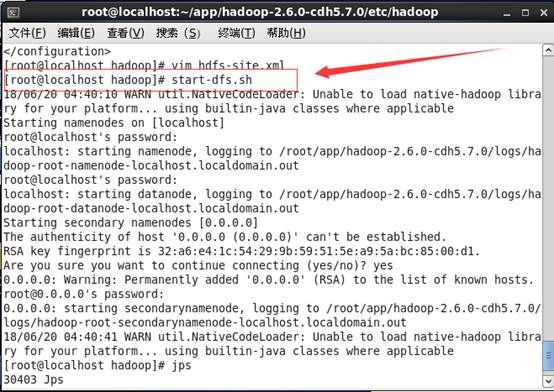

# 2. 安装Hadoop

2.1. 下载并解压Hadoop，
已经下载并放到桌面上，直接解压，安装
解压：tar -zxvf Hadoop-2.6.0-cdh5.7.0.tar.gz

查看目录，并进入/etc/Hadoop/


2.2.   修改配置文件

hadoop配置文件的修改($HADDOP_HOME/etc/hadoop)
hadoop-env.sh

         export JAVA_HOME=/usr/java/jdk1.8.0_171-amd64
         

         

```
 core-site.xml

         <property>

             <name>fs.defaultFS</name>

             <value>hdfs://localhost:9000</value>

         </property>

 

         由于hadoop伪分布式存储默认使用宿主系统的临时文件夹，会导致每次宿主系统重启后丢失，需要手动制定一个目录

         <property>

              <name>hadoop.tmp.dir</name>

              <value>/home/hadoop/app/tmp</value>

         </property>

 

     hdfs-site.xml

         <property>

            <name>dfs.replication</name>

             <value>1</value>

        </property>
```    


2.3 给Hadoop配置环境变量

添加环境变量：

```
export HADOOP_HOME=/home/hadoop/app/hadoop-2.6.0-cdh5.7.0

export PATH=$HADOOP_HOME/bin:$HADOOP_HOME/sbin:$PATH
```


2.4 使环境变量生效 source /etc/profile

查看Hadoop

2.5 启动hdfs

2.6 格式化分布式文件系统（仅第一次执行即可，不可重复执行）：

     hdfs namenode -format
     
启动: start-dfs.sh

2.7 验证是否启动成功：

         jps

              NameNode

              SecondaryNameNode

              DataNode
            

2.8 浏览器访问方式：http://localhost:50070

2.9 关闭hdfs

     stop-dfs.sh
     
