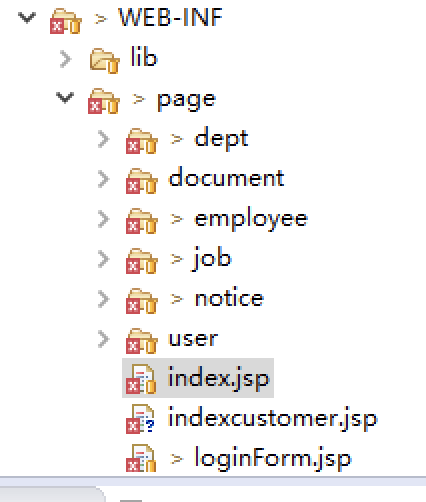
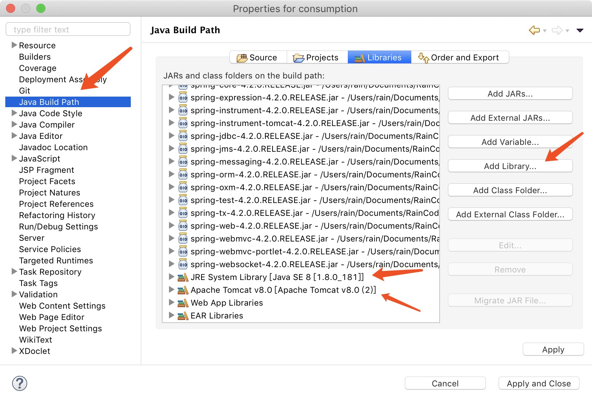

# Java项目部署文档
### 本文档仅针对我GitHub或gitee上发布的项目，由于有很多同学问这个问题，所以特此写一篇文档说明。
### 项目中基本的就是普通web程序和ssm框架程序，springboot程序。
## 我的基本环境
* Eclipse
* Jdk8
* Tomcat8
* Mysql5.7

## 1. jsp-servlet程序
再基于上述环境搭建完毕后。
1. 将代码中的sql文件导入数据库中，这里导入过程是指使用可视化sql管理工具导入，如Navicat，需要先建立一个名字相同的数据库，然后右键运行sql文件即可。
2. 就代码导入eclipse，在eclipse中file菜单中选择import，按照下图选择对应选项，可以看到导入按钮，即完成导入。

3. 大部分程序这时候都会报错，例如.jsp的文件全部报错，如下图，这种情况是项目的tomcat找不到你本地的tomcat，你需要进入项目修改一下你本地的tomcat

在java build path中，看看有没有tomcat和jre

4. 但项目整体没有错误后，找到util包里的DbUtil这种名称的文件，里面有数据库连接地址，修改用户名和密码为本地的数据库用户名和密码。
这里需要提醒大家，数据库密码最好不用123456，因为有些地方这个密码会强制认为是有问题的，这就很尴尬了，所以还是用个英文的。
5. 最后在项目中某个jsp文件中右键，run server。
6. 自此项目整体应该没有问题了，因为我是本地测试通过后发布的，每个人电脑不同大致会出现这几类问题，如果还有报错或者无法运行，请加QQ群再解决问题。

## 2. SSM框架程序的部署
部署方式遵循上面👆前三步即可，第四步开始你需要找到db.properties的文件，里面有数据库连接地址，修改用户名和密码为本地的数据库用户名和密码。
1. 这里需要提醒大家，数据库密码最好不用123456，因为有些地方这个密码会强制认为是有问题的，这就很尴尬了，所以还是用个英文的。
2. 最后在项目中某个jsp文件中右键，run server。
3. 自此项目整体应该没有问题了，因为我是本地测试通过后发布的，每个人电脑不同大致会出现这几类问题，如果还有报错或者无法运行，请加QQ群再解决问题。

##  3. Springboot程序的部署
Springboot是我最喜欢的框架，所以肯定是用我最喜欢的IDEA来开发了，网上很多教程是用eclipse，我这里统一用idea，如果用eclipse出现问题我也没办法了。
Idea的好处就是过程很简单，直接open一个项目即可
1. 将代码中的sql文件导入数据库中，这里导入过程是指使用可视化sql管理工具导入，如Navicat，需要先建立一个名字相同的数据库，然后右键运行sql文件即可。
2. open我的项目
3. 找到application.yml或者application.properties这种的配置文件，里面有数据库链接地址，修改用户名和密码为本地的数据库用户名和密码。
这里需要提醒大家，数据库密码最好不用123456，因为有些地方这个密码会强制认为是有问题的，这就很尴尬了，所以还是用个英文的。
3. 运行项目

## 先就这样，有其他问题后期我再补充
